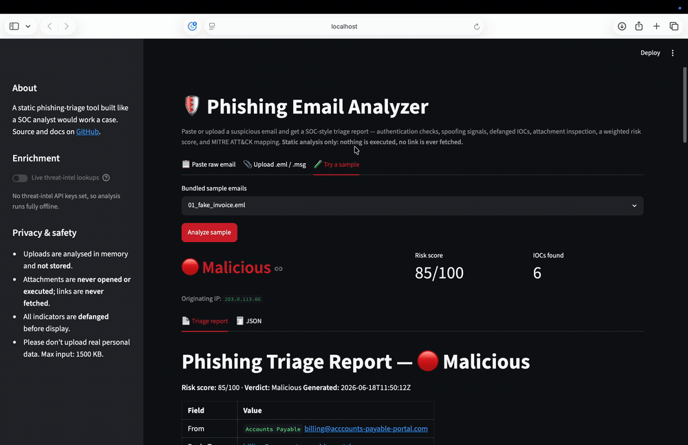
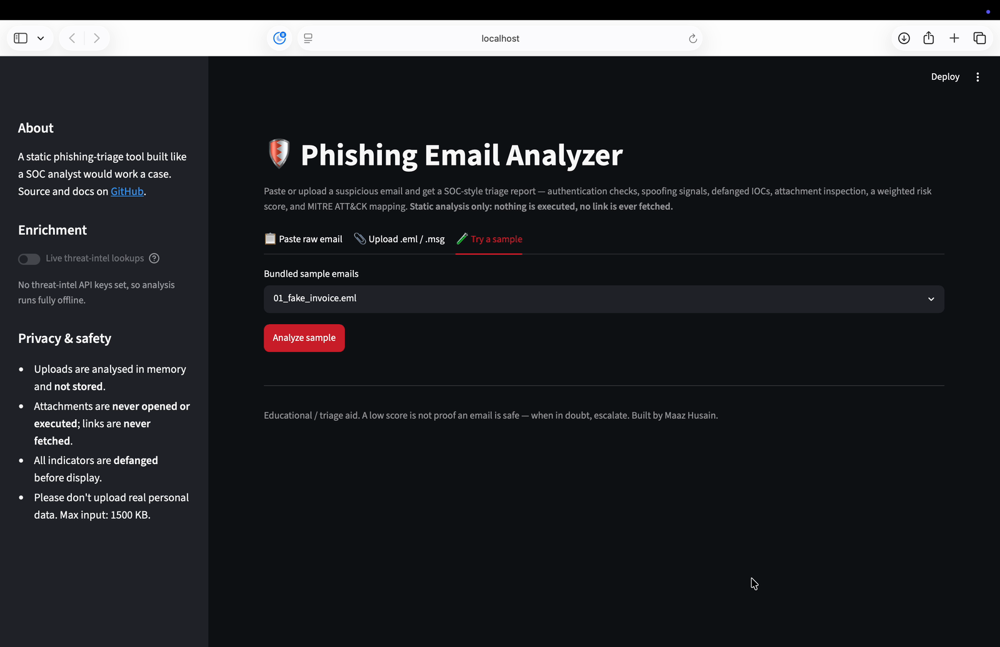
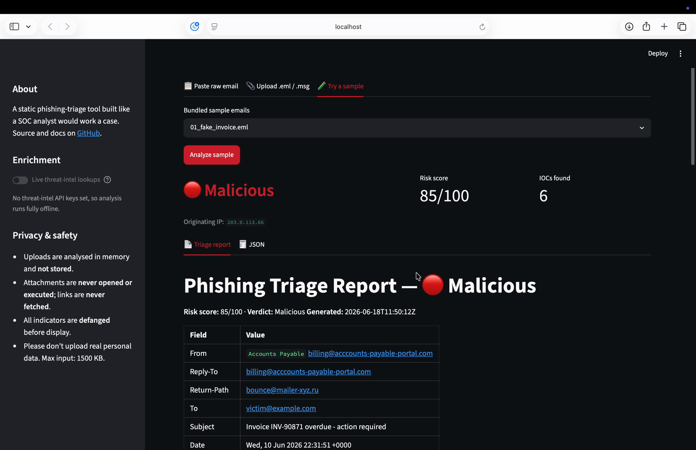

# Phishing Email Analyzer


## Live demo

A hosted web version lets anyone paste or upload a suspicious email and get the
same triage report in the browser — **static analysis only, no link is ever
fetched and no attachment is ever executed**.

🔗 **Try it:** _add your Streamlit URL here after deploying (see [DEPLOY.md](DEPLOY.md))_



<details>
<summary>More screenshots</summary>





</details>

A command-line tool that takes a suspicious email, pulls it apart the way a SOC
analyst would, and writes up a verdict. It checks the authentication headers,
traces where the mail actually came from, extracts and defangs the indicators
of compromise, statically inspects any attachments, scores the risk, and saves
a Markdown report plus a JSON file you can feed into other tooling.

Everything is **static** — no attachment is ever opened, executed, or
detonated. It runs natively on macOS (or any machine with Python 3.10+) and
needs no VM.

## Quick start

```bash
git clone <this-repo> && cd phishing-email-analyzer
python3 -m venv venv && source venv/bin/activate
pip install -r requirements.txt

# Analyse the bundled synthetic samples (fully offline)
python -m src.cli batch samples --no-enrich
```

```
[Malicious]  score=85/100   01_fake_invoice.eml
[Suspicious] score=55/100   02_credential_harvest.eml
[Malicious]  score=100/100  03_macro_attachment.eml
[Suspicious] score=35/100   04_bec_ceo_fraud.eml
[Suspicious] score=30/100   05_ai_generated_phish.eml
```

## Why I built it

Phishing triage is one of the most common things a Tier-1 SOC analyst does all
day: an email lands in the abuse mailbox, and someone has to decide quickly
whether it's junk, a credential-harvesting page, or something with a live
payload. I wanted a tool that walks that decision the way I would by hand, and
that explains *why* it reached a verdict rather than just printing a number.

The explainability is the point. Every point in the risk score traces back to a
named finding with a human-readable reason, so the report reads like an analyst
note, not a black box.

## What it does

- Parses `.eml` and `.msg` into one structured object, and doesn't fall over on
  malformed or missing headers — it records what was missing instead.
- Reads SPF / DKIM / DMARC results out of `Authentication-Results`.
- Traces the `Received:` chain back to the earliest originating IP.
- Flags spoofing: `From` vs `Return-Path` vs `Reply-To` mismatches, brand names
  hidden inside the sending domain, executive impersonation from free webmail
  (the classic BEC tell), and display-name brand impersonation.
- Extracts URLs, domains, IPs, sender addresses and hashes, de-duplicates them,
  separates sender infrastructure from body/link indicators, and defangs
  everything (`hxxp`, `[.]`) so the report is safe to paste around.
- Detects lookalike / typosquatted domains against a list of commonly abused
  brands.
- Statically inspects attachments: hashes everything, pulls macros out of Office
  documents and flags auto-execution triggers and suspicious calls, and flags
  PDFs that carry JavaScript, OpenAction, Launch actions or embedded files.
- Scores the email with tunable, rule-based weights and maps it to a band
  (Low / Suspicious / Malicious).
- Optionally enriches indicators against VirusTotal, AbuseIPDB and URLhaus, and
  can hand the whole IOC set to my ThreatLens platform (see
  [ThreatLens integration](#threatlens-integration)). With no API keys
  configured it skips enrichment and still produces a complete report.
- Maps findings to MITRE ATT&CK and writes Markdown + JSON, single email or a
  whole folder at once.

## Architecture

```
                 ┌──────────┐
   .eml / .msg → │  parser  │ → EmailObject
                 └──────────┘
                       │
         ┌─────────────┼──────────────┐
         ▼             ▼              ▼
   ┌──────────┐  ┌──────────┐  ┌─────────────┐
   │ headers  │  │   iocs   │  │ attachments │   (all static)
   └──────────┘  └──────────┘  └─────────────┘
         │             │              │
         └─────────────┼──────────────┘
                       ▼
                 ┌──────────┐   (VirusTotal / AbuseIPDB /
                 │  enrich  │    URLhaus / ThreatLens — optional)
                 └──────────┘
                       ▼
                 ┌──────────┐
                 │  score   │ → weighted, reason-tagged findings
                 └──────────┘
                       ▼
                 ┌──────────┐
                 │  report  │ → Markdown + JSON
                 └──────────┘
```

Data flow: `parse → (headers + iocs + attachments) → enrich → score → report`.
Each stage is a small module under `src/` with pure functions where possible,
which is what makes it testable.

## Install

```bash
python3 -m venv venv && source venv/bin/activate
pip install -r requirements.txt
```

The tool runs with nothing but the standard library if you skip the optional
dependencies, but `oletools`, `tldextract` and `iocextract` make the macro,
domain and IOC analysis sharper.

## Usage

Analyse a single email:

```bash
python -m src.cli analyze samples/01_fake_invoice.eml
```

Analyse a whole folder and get a summary index:

```bash
python -m src.cli batch samples/ --out reports
```

Force a fully offline run (no network calls at all):

```bash
python -m src.cli analyze suspicious.eml --no-enrich
```

Reports land in `reports/` as `<name>.md` and `<name>.json`, plus an `index.md`
in batch mode ranked worst-first.

## What a report looks like

```
# Phishing Triage Report — 🔴 Malicious

**Risk score:** 85/100  ·  **Verdict:** Malicious

| Field        | Value                                              |
|--------------|----------------------------------------------------|
| From         | Accounts Payable <billing@acccounts-payable-portal.com> |
| Return-Path  | bounce@mailer-xyz.ru                               |
| Originating IP | 203.0.113.66                                    |

## Authentication
| Mechanism | Result |
| SPF  | ❌ fail |
| DKIM | ➖ none |
| DMARC| ❌ fail |

## Score breakdown
| Signal             | Points | Reason                                            |
| PDF_ACTIVE_CONTENT | +30    | PDF contains JavaScript, OpenAction (runs on open)|
| SPF_FAIL           | +20    | SPF authentication fail                           |
| DMARC_FAIL         | +20    | DMARC policy failed                               |
| ENVELOPE_MISMATCH  | +15    | Envelope sender domain differs from From          |
| Total              | 85     | Malicious                                         |
```

## Risk scoring

The score is just the sum of the weights of the findings that fired, capped at
100, then mapped to a band. Nothing hidden, every point attributable.

| Signal | Weight |
|--------|-------:|
| SPF fail | +20 |
| DKIM fail | +15 |
| DMARC fail | +20 |
| From / Return-Path mismatch | +15 |
| Reply-To redirect (different mailbox) | +15 |
| Display-name brand impersonation | +15 |
| Executive impersonation from free webmail (BEC) | +20 |
| Brand name embedded in sending domain | +15 |
| Lookalike / typosquat domain | +15 |
| URL or domain flagged (VirusTotal / URLhaus) | +25 each |
| Attachment hash known-bad (VirusTotal) | +40 |
| Originating IP flagged (AbuseIPDB ≥ 50%) | +20 |
| Office macro with auto-execution | +30 |
| PDF with active/embedded content | +30 |

Bands: `0–29 Low · 30–59 Suspicious · 60+ Malicious`.

The weights live in `src/config.py` and can be overridden from `.env`, so you
can tune them against your own corpus. I tuned mine against the five case-study
samples below: I wanted a single hard auth failure plus one supporting signal to
land in *Suspicious*, and a live payload (macro/PDF) or a stack of auth failures
to push into *Malicious*. The BEC case deliberately has no payload and passes
authentication — it only crosses into *Suspicious* on behavioural signals (free
webmail + an executive display name + a Reply-To that routes elsewhere), which
is exactly why BEC is hard to catch and worth scoring on behaviour rather than
infrastructure.

## Case studies

Five worked investigations, each with what I saw, how I read it, the verdict,
and the ATT&CK mapping. These are where the analyst judgement lives.

1. [Fake invoice — attachment lure](docs/case-studies/01-fake-invoice.md)
2. [Credential harvesting — lookalike login link](docs/case-studies/02-credential-harvesting.md)
3. [Malware attachment — macro-enabled Office doc](docs/case-studies/03-macro-attachment.md)
4. [Business Email Compromise — display-name spoof, no payload](docs/case-studies/04-bec.md)
5. [AI-generated phishing — clean grammar, passes auth](docs/case-studies/05-ai-generated-phishing.md)

## MITRE ATT&CK

| Technique | ID |
|-----------|-----|
| Phishing | T1566 |
| Spearphishing Attachment | T1566.001 |
| Spearphishing Link | T1566.002 |
| User Execution: Malicious File | T1204.002 |
| User Execution: Malicious Link | T1204.001 |

## ThreatLens integration

This analyzer is built to feed ThreatLens — my separate threat-intelligence
platform that collects, enriches, scores and correlates IOCs. Set `THREATLENS_BASE_URL` (and optionally `THREATLENS_API_KEY`) in `.env`
and every analysed email's extracted indicators are POSTed to ThreatLens for
deeper correlation against the rest of your intel. The email tool answers "is
this one message malicious"; ThreatLens answers "have we seen this
infrastructure before, and where". Two tools that talk to each other tell a
better story than two that don't.

## Safety and handling

- Static analysis only. No attachment is opened or executed on the host.
- The committed `.eml` files in `samples/` are **safe, fully synthetic** test
  emails with inert payloads, built by `samples/make_samples.py` so anyone can
  reproduce the case studies instantly. Real malicious samples are never
  committed — keep those zipped, password-protected, and out of git.
- API keys come from `.env` only — `.env.example` is the template, and `.env` is
  gitignored. Nothing secret is in the code.
- If you ever want dynamic analysis, detonate inside an isolated VM. That's out
  of scope for this tool by design.

## Tech stack

Python 3.10+ · built-in `email` / `hashlib` · `extract-msg` (.msg) ·
`oletools` (macros) · `iocextract` + `tldextract` (IOCs) · `httpx` (enrichment)
· stdlib `argparse` (CLI) · `pytest` (tests).

## Tests

```bash
python -m pytest
```

Unit tests cover the parser (malformed input included), header/auth analysis,
IOC extraction and defanging, and the scoring bands. CI runs the suite plus an
offline smoke-test over all five samples on Python 3.10–3.13.

## What I learned

Reading `Received:` chains and `Authentication-Results` headers carefully — and
realising how much spoofing you can catch from headers alone, before you ever
touch a sandbox. Also that BEC is a different problem from payload phishing:
it's quieter, it passes SPF/DKIM/DMARC because it comes from a real (free)
mailbox, and you have to score it on behaviour. Building the tool to hand its
output to ThreatLens made me think about indicators as a pipeline rather than a
one-off lookup.

## License

MIT — see [LICENSE](LICENSE).
